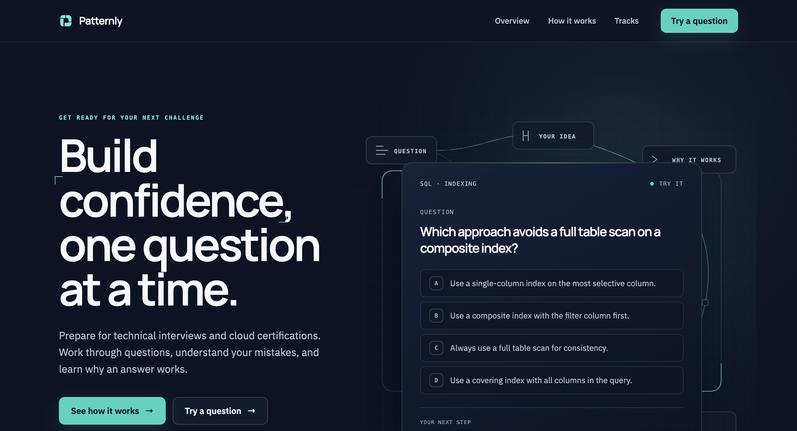
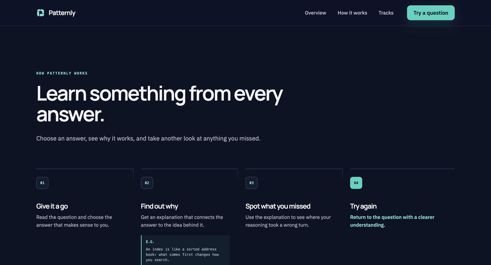
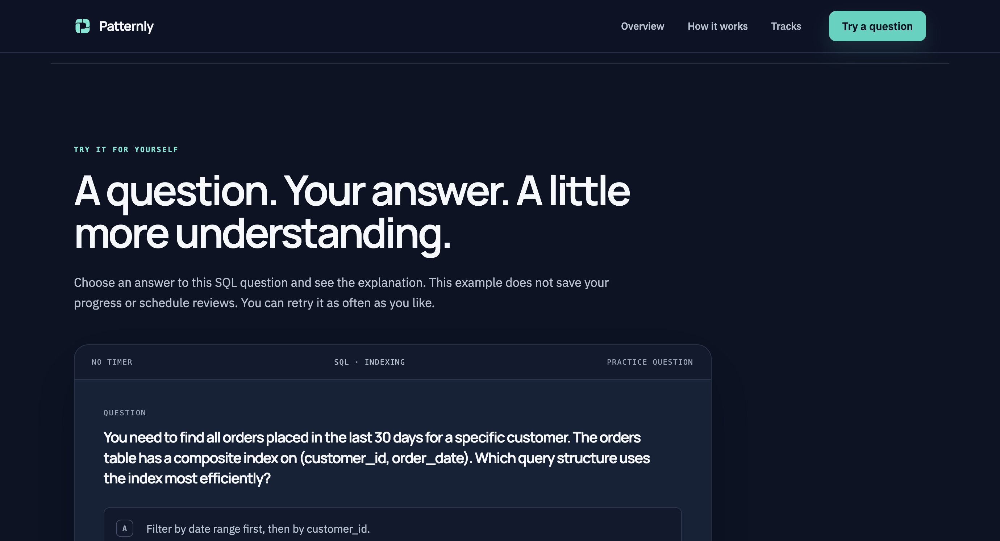
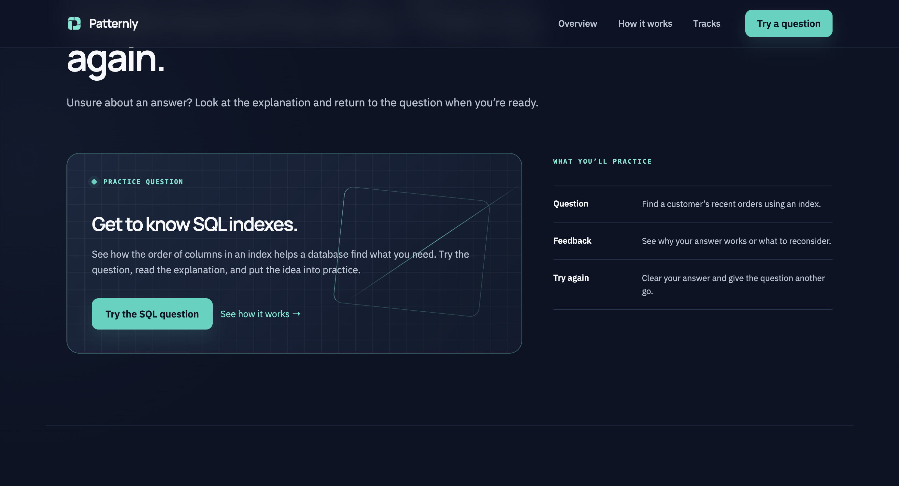
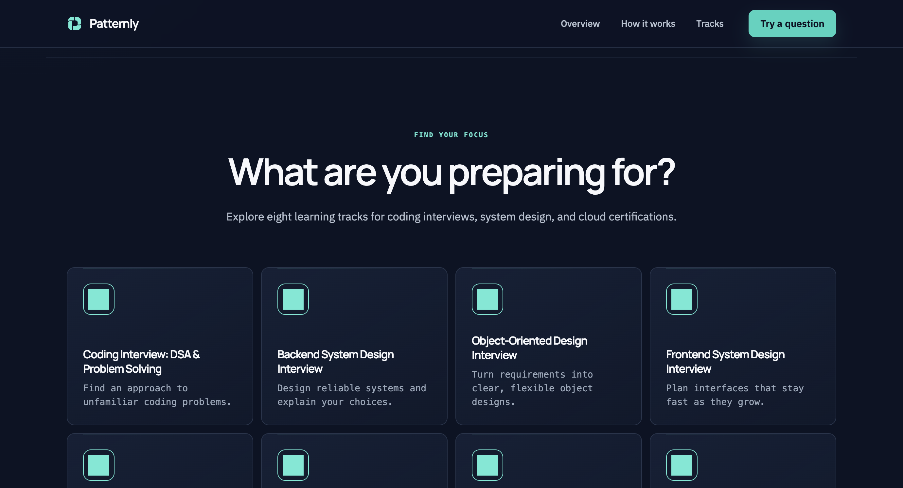
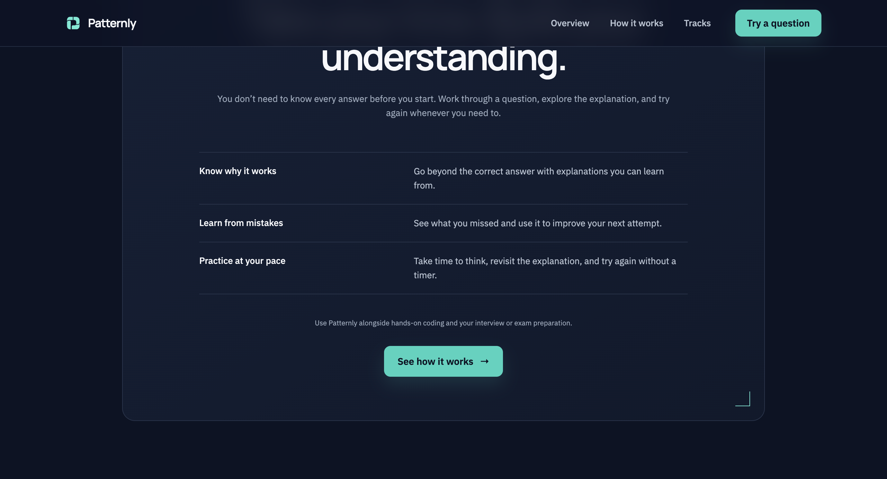

# Patternly web — audyt 2026-09-03

Zakres: aktualna strona publiczna http://localhost:5173/ w Operze, odczyt interfejsu i kodu. Cel: spójna prezentacja mobilnych tracków i zrozumiały pierwszy kontakt z ćwiczeniem. Nie zmieniano kodu aplikacji. Zrzuty 2760 × 1494 piksele; nie ustalono skali DPR ani zoomu. To przegląd widoku desktopowego, nie pełny test dostępności.

## Przejrzane kroki

1. Hero — czytelny kierunek copy, ale duży nagłówek zajmuje cztery linie, a dolna część ćwiczenia wypada poza pierwszy ekran. Główny przycisk prowadzi do opisu, podczas gdy nagłówek nawigacji promuje ćwiczenie.
2. Jak to działa — spójne cztery kroki. Duża ilość pionowego miejsca przed treścią; przekaz jest później wielokrotnie powtarzany.
3. Ćwiczenie — pytanie jest czytelne, ale rozbudowany wstęp odsuwa odpowiedzi poniżej widocznego obszaru. Treść i połączenie z hero wymagają poprawy.
4. Dodatkowe wyjaśnienie — poprawnie ułożone kolumny, ale kolejna sekcja ponownie promuje to samo pytanie SQL. Nie dodaje nowej funkcji.
5. Tracki — potwierdzony błąd ikon: osiem jednolitych kwadratów. Nierówno rozpoczynają się tytuły kart; opisy zachowały monospace mimo zmiany na pełne zdania.
6. Zakończenie — czytelne treści, ale powtórzenie wcześniejszych obietnic i ponowne odesłanie do opisu zamiast jasnego następnego działania.

Zrzuty 04 i 06 pokazują fragment sekcji po nawigacji bezpośrednio do ID nagłówka. Jego przesłonięcie przez sticky header nie jest tu zgłaszane jako błąd normalnej nawigacji, ponieważ takie linki nie występują w interfejsie.

## Ustalenia i priorytety

### P1 — ikony są zastąpione pełnymi kwadratami

Dowód: 05-tracks.png. SVG w assets/icons odpowiadają plikom mobilnym, a przypisanie do ośmiu tracków zgadza się z SelectTrackScreen. Problem dotyczy renderowania: src/pages/PublicPage.jsx:189 używa barwionego span z maskImage; styles.css:269–270 określa prostokątne tło. W widoku pozostaje samo tło. Bez computed styles nie rozstrzygnięto, czy winna jest obsługa właściwości, serializacja czy ładowanie maski.

Naprawa: zastąpić maskowany span bezpośrednim renderowaniem istniejących SVG, zachować geometrię i mapowanie mobilne. Usunąć ścieżkę maskowania zamiast dodawać kolejne warstwy. Kryterium: osiem rozróżnialnych znaków w Operze, zgodnych z mobilką; poprawny kolor w buildzie produkcyjnym.

### P1 — niejednoznaczne ćwiczenie SQL

Dowód: 01-hero.png, 03-session.png i src/components/InteractiveQuestion.jsx:3–20, 60, 89, 102. Pierwsze pytanie nie definiuje konkretnego zapytania ani silnika, ale oznacza jeden ogólny wariant jako poprawny. Drugie zestawia „filter by date first” z „customer_id first”, co może być rozumiane jako kolejność warunków WHERE. Feedback obiecuje „without a scan”, co jest zbyt absolutne.

Naprawa: zadać jedno konkretne pytanie o kolejność kolumn indeksu B-tree przy warunku równości i zakresie. Nie utożsamiać kolejności kolumn indeksu z kolejnością ewaluacji wyrażeń SQL. Wyjaśnić ograniczenie skanowanego zakresu zamiast obiecywać brak skanu.

Podstawa merytoryczna: [indeksy wielokolumnowe PostgreSQL](https://www.postgresql.org/docs/current/indexes-multicolumn.html) i [reguły ewaluacji wyrażeń](https://www.postgresql.org/docs/current/sql-expressions.html#SYNTAX-EXPRESS-EVAL). Zapytania nie były wykonywane na bazie.

### P2 — dwa niezależne przebiegi ćwiczenia

Dowód: hero ma osobny selected w PublicPage.jsx:82; SessionQuestionCard ma własny selected w InteractiveQuestion.jsx:75. Komunikat „Correct — see the explanation below” w linii 68 nie jest linkiem ani wyjaśnieniem. Niżej znajduje się inne pytanie bez wybranej odpowiedzi.

Naprawa: jedna kanoniczna instancja pytania, odpowiedzi, feedbacku i ponowienia. Wszystkie CTA do ćwiczenia kierują do niej. Usunąć drugi stan, drugą tablicę odpowiedzi i nieużywane style po scaleniu. Nie synchronizować dwóch różnych pytań za pomocą nowej warstwy stanu.

### P2 — layout kart nie został dostosowany do opisów

Dowód: 05-tracks.png; styles.css:107, 265–268. justify-content: space-between dociska różnej wysokości bloki tekstu do dołu kart, więc nagłówki startują na różnych wysokościach. Opisy dziedziczą --font-utility, przez co nadal przypominają tekst techniczny.

Naprawa: stały odstęp od ikony do nagłówka i wyrównanie treści od góry; font tekstowy dla opisów. Bez ręcznych wyjątków dla poszczególnych tracków i bez sztywnych wysokości przycinających tekst.

### P2 — długość strony i powtarzające się CTA

Dowód: kroki 02, 04, 06 i PublicPage.jsx:105–207. Method, Evidence oraz Boundaries wielokrotnie powtarzają „answer, understand, try again”; dodatkowa sekcja SQL zawraca do poprzedniego pytania. Pod trackami użytkownik znów wraca do opisu metody.

Naprawa: połączyć powtarzające się informacje z sekcją ćwiczenia i skrócić zakończenie. Zachować osiem tracków. Ujednolicić główne CTA do rzeczywiście dostępnego działania. Nie dodawać pozornych linków do tracków, sklepu ani logowania użytkownika.

### P3 — nadmierna wysokość pierwszych ekranów

Dowód: 01, 02, 03; styles.css:127 i reguły h1/h2 oraz sekcji. W widoku hero nagłówek zajmuje cztery linie; w sekcji ćwiczenia nagłówek i odstępy zajmują dużą część ekranu przed odpowiedziami.

Naprawa: krótszy nagłówek sesji, mniejsze odstępy i ponowna ocena wielkości h1. Kryterium: czytelne CTA i kontekst pytania bez dominacji dekoracji, także przy wąskim ekranie i powiększeniu tekstu.

## Plan wykonawczy

Ocena podejścia: minimum 0,85/1 (zgodność z celem 0,95; prostota 0,90; bezpieczeństwo zmian 0,85; utrzymanie i weryfikacja 0,90). Preferowane zastępowanie i scalanie istniejących ścieżek. Ponowić ocenę przed wdrożeniem, jeśli pojawią się nowe ograniczenia.

Pakiety nadają się do przekazania wykonawcy, ale należy realizować je kolejno ze względu na wspólne pliki. Nie uruchomiono agentów.

1. Ikony i karty. Zakres: PublicPage.jsx, styles.css, istniejące assets/icons; porównanie tylko do odczytu z mobilnym SelectTrackScreen i SVG. Wynik: poprawne ikony i wyrównane nagłówki. Weryfikacja: wszystkie osiem ikon na zrzutach Opery, build, porównanie geometrii. Stop: nie zmieniać design systemu mobilki ani dodawać biblioteki ikon; nie zamykać zadania bez wizualnego potwierdzenia.
2. Jedno poprawne ćwiczenie. Zakres: PublicPage.jsx, InteractiveQuestion.jsx, DecisionField.jsx i style wyłącznie zależne od zastępowanej karty. Wynik: jedno pytanie, jednoznaczny klucz, feedback przy odpowiedzi i działający reset. Weryfikacja: wybór błędnej/poprawnej odpowiedzi, rozwinięcie wyjaśnienia, ponowienie, klawiatura; merytoryczne sprawdzenie pytań. Stop: bez backendu, zapisywania postępów ani zmian schematu treści mobilnych.
3. Skrócenie strony. Zakres: PublicPage.jsx, styles.css, README.md, scripts/verify-local.mjs tylko w odniesieniu do zmienionych kontraktów. Wynik: usunięte powtórzenia, spójne CTA, mniejsze odstępy i zachowane osiem tracków. Weryfikacja: desktop, 390 px, 320 px, zoom 200%, linki sekcji i menu. Stop: nie dodawać nowych tras, sprzedaży ani pozornych funkcji.

W każdym pakiecie: sprawdzić imports, eksporty, selektory CSS, route/anchor references, testy, docs i artefakty. Usuwać wyłącznie kod, którego użycia zniknęły po zastąpieniu. Uruchomić npm run verify:local i git diff --check, ale nie traktować tych wyników jako dowodu poprawnego wyglądu.

## Ograniczenia dowodów

Konektor Opery udostępnia nawigację, odczyt drzewa dostępności i screenshot, ale nie kliknięcia odpowiedzi, zmianę viewportu, computed styles ani klawiaturę. Nie wykonano pełnych testów interakcji, urządzeń mobilnych, zoomu, screen readera ani kontrastu. W kodzie widoczne są etykiety radio, aria-live, skip link i obsługa reduced motion — to pozytywne podstawy, nie potwierdzenie dostępności. Brak linku z kart tracków jest faktem, ale nie jest sam w sobie zgłaszany jako błąd, ponieważ obecna strona jest katalogiem.

## Zrzuty

